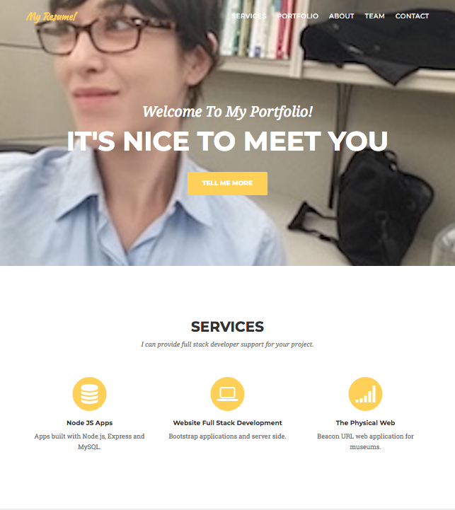
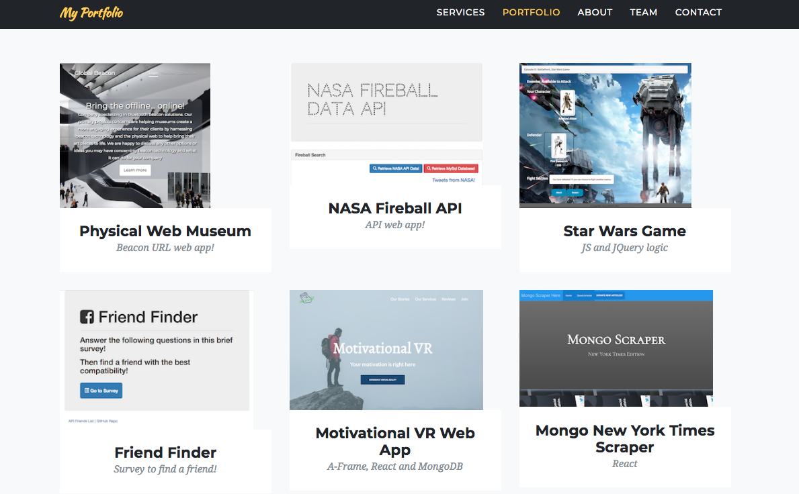
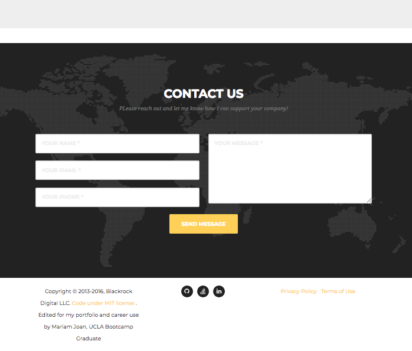

### Portfolio!
This is my portfolio and represents a culmination of all projects I've built as a student of the UCLA Full Stack Developer Certificate Program from August 2017 to February 2018. This will also include my social media, technical resume and a way to contact me for developer purposes. Please see important information from Start Bootstrap who was the creator of this Bootstrap Agency one page template! I've edited this template to include all relevant information for my projects, including Heroku and or GitPages live hosted sites. Thank you for reading this ReadMe.md and have an amazing day!  

## Portfolio Screenshots!

## Information about the [Start Bootstrap](http://startbootstrap.com/) Agency template for my portfolio! 
##[Agency](http://startbootstrap.com/template-overviews/agency/) is a one page agency portfolio theme for [Bootstrap](http://getbootstrap.com/) created by [Start Bootstrap](http://startbootstrap.com/). This theme features several content sections, a responsive portfolio grid with hover effects, full page portfolio item modals, a responsive timeline, and a working PHP contact form. Start Bootstrap was created by and is maintained by **[David Miller](http://davidmiller.io/)**, Owner of [Blackrock Digital](http://blackrockdigital.io/).

* http://davidmiller.io
* https://twitter.com/davidmillerskt
* https://github.com/davidtmiller

Start Bootstrap is based on the [Bootstrap](http://getbootstrap.com/) framework created by [Mark Otto](https://twitter.com/mdo) and [Jacob Thorton](https://twitter.com/fat).

## Copyright and License
Copyright 2013-2017 Blackrock Digital LLC. Code released under the [MIT](https://github.com/BlackrockDigital/startbootstrap-agency/blob/gh-pages/LICENSE) license.
